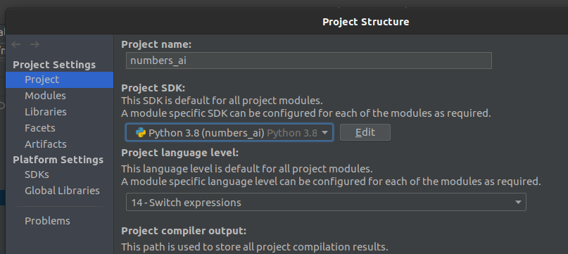
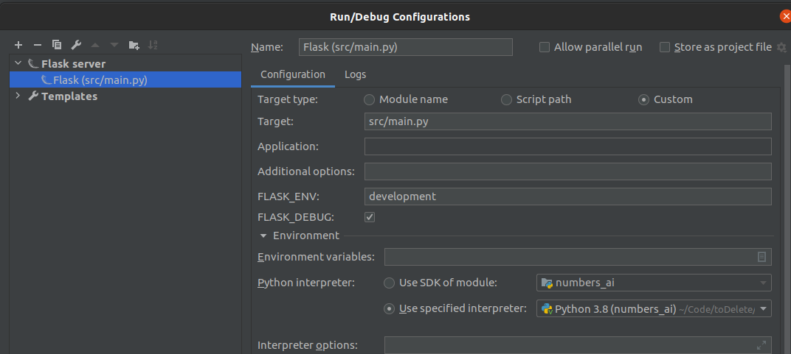
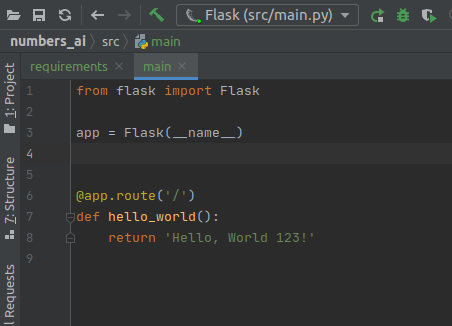

## Numbers AI Predictor Project

### To run the app with Docker
- Build docker image
`docker build -t mikenieto/numbersai .`

- Run locally
`docker run --rm --name mikenieto/numbersai -p 5000:5000 numbersai`

-- Push image
`docker push mikenieto/numbersai`

### IntelliJ - PyCharm Configuration
In _File / Project Structure..._ select as a Project SDK a new folder venv in
the same folder of the project

Additionally, you can add a Flask Server configuration to run it in a Dev mode
using the _Edit Configurations..._

Add then run it

